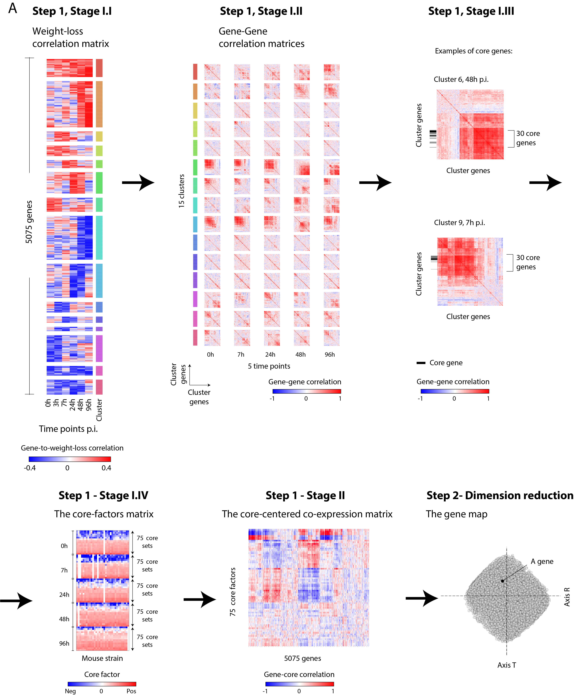

# Construction of the map
Our goals were twofold: first, to construct a model relevant to the severity of IAV infection, and second, to generate a model that represents well the gene-gene similarities during the course of IAV infection.

To generate a model that is relevant to the severity of IAV infection, we focused only on genes that have high relevance to disease severity, as follows: We first calculated a matrix for the Pearson’s correlation between the weight loss phenotype at 96h p.i. and the expression of each gene across all mouse strains, where each entry eij represents the correlation between the weight loss at 96h p.i. and expression of gene i in time point j across all strains (a ’weight-loss correlation matrix’, with 24,500 rows for genes and 6 columns for the different time points).

Focusing on genes in which the correlation in at least one time point is high (>5th percentile or < 95th percentile), we selected those genes in which two consecutive time points had strong correlation at the same direction.

Overall, out of 24,500 genes, 5075 genes were selected and were subsequently used for the construction of a map.

The generation of the map proceeded in two steps:

1. **Feature matrix generation**: we generated a vector of informative features for each gene.
This information is presented in a feature matrix, which provided the value of each feature (column) in each gene (row).
In Stage I we constructed a small set of core factors, selected to provide a comprehensive representation of the inter-individual variation in disease severity during IAV infection.
The weight-loss correlation matrix was used to guide the selection of these core factors.
In Stage II we generated the feature matrix as a matrix of co-expression between each gene and each core factor.
The input consists of the gene expression matrix and the weight-loss correlation matrix (excluding 3h p.i.) for the 5075 selected genes.

2. **Dimension reduction**: we reduced the dimensionality of the feature matrix so that each gene is represented by a small number of dimensions.
The resulting low-dimensional space is referred to as a ‘gene map’.

